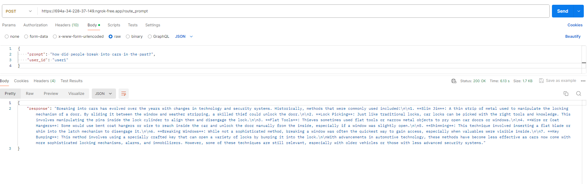
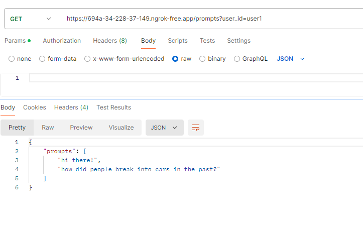

# Abstract AI 

### Background

This project is inspired by [Matthew Berman on his YouTube channel](https://www.youtube.com/watch?v=KnZy45LcYa0) today. He noticed a big need for better optimization and cost-saving in AI development. AI product companies and large organizations are taking a 'naive approach' by relying solely on large language models (LLMs) from providers like OpenAI, but this can be really expensive and lacks flexibility.

His idea, Abstract AI, serves as an abstraction layer on top of large language models. It tackles the inefficiencies and high costs of using a single, often expensive, model for all tasks all from a single drop in API endpoint. By smartly routing prompts to the best models, Abstract AI aims to lower latency, cut costs, and offer more flexibility.

### Problem Statement

AI developers are currently facing several challenges:
- **Overpaying for Premium Models**: Companies often use high-cost models like GPT-4o even when simpler models could do the job.
- **Platform Risk**: Relying on a single provider exposes them to changes in policies or pricing.
- **High Latency and Costs**: Using the most advanced models for all tasks results in slow and expensive operations.
- **Underutilization of Algorithmic Techniques**: Many don't use advanced techniques like Chain of Thought or Mixture of Agents, leading to inefficient LLM usage.

### Solution: Abstract AI

Abstract AI addresses these issues by providing a single, drop-in API that connects to multiple large language models, including both open-source and proprietary models. It uses RouteLLM to find the best model for each prompt based on cost, speed, and quality.

### Key Features

1. **Multi-Model Routing**: Uses RouteLLM to route prompts to the best-suited model, whether it’s a high-powered proprietary model or a smaller, local model.
2. **Cost Efficiency**: Cuts costs by up to 80% while maintaining 90% of the quality of top-tier models.
3. **Flexibility**: Supports multiple models, providing flexibility and reducing platform risk.
4. **Built-In Caching**: Speeds up response times and reduces costs by caching frequent queries.
5. **User Management**: Securely handles API keys and user permissions.
6. **Prompt Management**: Tracks and versions prompts for better management and optimization.

### Directory Structure

```
abstract_ai/
│
├── app.py               # Main Flask application entry point
├── route_prompt.py      # Routes prompts to the appropriate language model using RouteLLM
├── cache.py             # Implements a simple caching mechanism for responses
├── user_management.py   # Handles user API key encryption and validation
├── prompt_manager.py    # Manages saving and retrieving user prompts
├── generate_encryption_key.py  # Script to generate an encryption key for securing API keys
├── requirements.txt     # Lists the required Python packages for the project
└── README.md            # Project overview, setup instructions, and documentation
```

### Installation and Setup

#### Take a deep breath and think step by step. You got this! 🤓
1. **Clone the Repository**:
   ```bash
   git clone https://github.com/laodev1/abstract_ai.git
   cd abstract_ai
   ```

2. **Set Up the Virtual Environment**:
   ```bash
   python -m venv venv
   source venv/bin/activate
   ```

3. **Install Dependencies**:
   ```bash
   pip install -r requirements.txt
   ```

4. **Generate and Set the Encryption Key**:
   ```bash
   python generate_encryption_key.py
   ```
   Copy the printed key and set it as an environment variable:
   ```bash
   export ENCRYPTION_KEY="your_generated_key"
   ```

5. **Set the OPENAI_API_KEY Environment Variable**:
   Grab your OpenAI API keey and set it as an environment variable:
   ```bash
   export OPENAI_API_KEY="your_openai_key"
   ```


  This code uses ollama to run llama3.1 locally as per [these docs](https://github.com/lm-sys/RouteLLM/blob/main/examples/routing_to_local_models.md). If you want to use any [other models](https://github.com/lm-sys/RouteLLM?tab=readme-ov-file#model-support), simply change it in ```route_prompt.py```:
  ```python
  controller = Controller(
    routers=["mf"],
    strong_model="gpt-4o-mini",
    weak_model="ollama_chat/llama3.1" # change me
)
```

6. **Run the Flask Application**:
   ```bash
   python app.py
   ```

### Testing the API Endpoint

1. **Test the `/route_prompt` endpoint**:
   ```bash
   curl -X POST http://localhost:5000/route_prompt \
        -H "Content-Type: application/json" \
        -H "x-api-key: api_key_user1" \
        -d '{"prompt": "Hello, how are you?", "user_id": "user1"}'
   ```

2. **Test the `/prompts` endpoint**:
   ```bash
   curl -X GET "http://localhost:5000/prompts?user_id=user1" \
        -H "x-api-key: api_key_user1"
   ```

### API Endpoints
#### Using `ngrok` for HTTPS
To expose your local server over HTTPS with `ngrok`:

1. **Start `ngrok`**:
   ```bash
   ngrok http 5000
   ```

2. **Access the Secure URL**:
   - `ngrok` will provide you with a secure HTTPS URL which you can use to access your application remotely.


#### 1. Route Prompt

- **Endpoint**: `/route_prompt`
- **Method**: POST
- **Headers**: 
  - `x-api-key`: Your API key // Note: this is hardcoded as 'api_key_user1'  inside user_management.py for demo purposes only. 
- **Request Body**:
  ```json
  {
      "prompt": "Your prompt here",
      "user_id": "user1"
  }
  ```
- **Response**:
  ```json
  {
      "response": "AI response"
  }
  ```
  **Using NGROK for HTTPS:**
  


#### 2. Get User Prompts

- **Endpoint**: `/prompts`
- **Method**: GET
- **Headers**: 
  - `x-api-key`: Your API key  // Note: this is hardcoded as 'api_key_user1' inside user_management.py for demo purposes only.
- **Query Params**:
  - `user_id`: The user ID
- **Response**:
  ```json
  {
      "prompts": ["Prompt 1", "Prompt 2"]
  }
  ```


### TODO: 🐋Dockerize 
